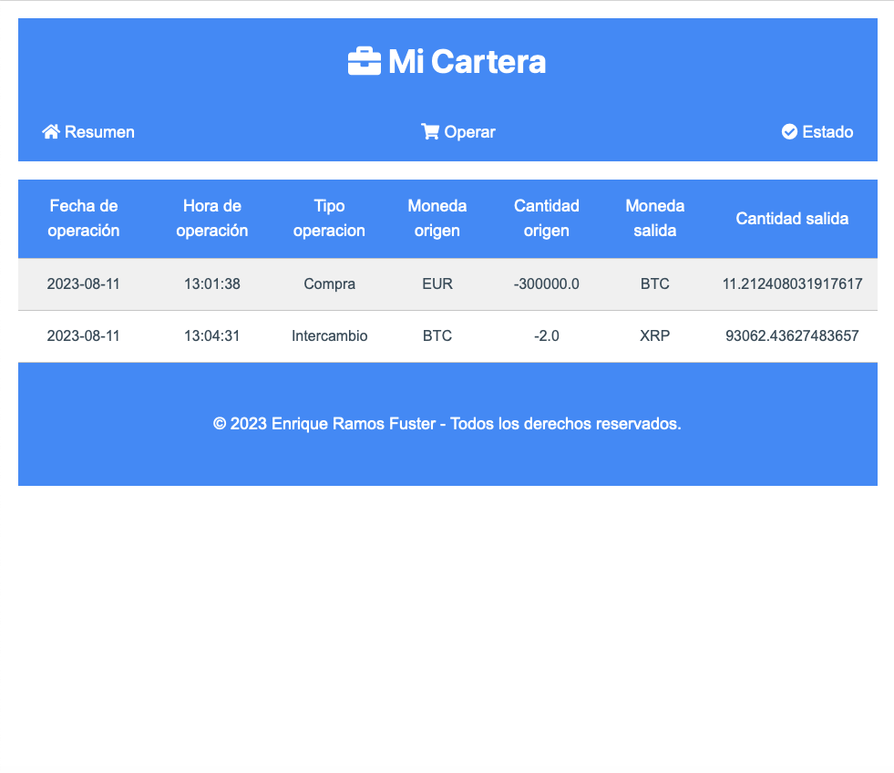

# Proyecto de aplicación web con Flask para gestionar Criptomonedas

Este proyecto es una aplicación web que te permite realizar operaciones de compra, venta e intercambio de criptomonedas. Utiliza Flask como framework web y SQLite como base de datos para almacenar los movimientos realizados. Mi Cartera ayuda a los usuarios a gestionar su cartera de criptomonedas mediante el seguimiento de transacciones, proporcionando valores de criptomonedas en tiempo real y ofreciendo una visión general del rendimiento de sus inversiones.

## Tabla de Contenidos

- [Características](#características)
- [Capturas de Pantalla](#capturas-de-pantalla)
- [Instalación](#instalación)
- [Uso](#uso)
- [Tecnologías](#tecnologías)
- [Contacto](#contacto)

## Características

- Seguimiento de transacciones de criptomonedas (compra, venta, intercambio).
- Visualización de valores de criptomonedas en tiempo real.
- Cálculo del valor actual de la cartera en Euros.
- Seguimiento del rendimiento de las inversiones con cálculos de ganancias/pérdidas.

## Capturas de Pantalla

## Instalación del proyecto

Para ejecutar Mi Cartera en tu máquina local, sigue estos pasos:

1. Abre tu terminal y clona este repositorio en tu máquina local.
2. Accede a la ruta en la que quieras clonar el proyecto
3. git clone https://github.com/Quikeramos1/WTFORMS_CRIPTO (5.5MiB)

4. Accede a la ruta en la que hayas clonado el proyecto y entra en /WTFORMS_CRIPTO

5. Crea y activa un entorno virtual (opcional pero recomendado).
6. python3 -m venv venv
7. source venv/bin/activate

8. Instala las dependencias del proyecto.
    pip install -r requirements.txt

9. Configura las variables de entorno (Crea tu archivo .env basándote en .env_template).
    Utiliza el .env_template para crear el env debidamente informado.

10. Ejecuta 'flask run' en tu terminal para levantar el servidor.

## Uso

Una vez que la aplicación esté en funcionamiento, abre tu navegador web y accede a http://localhost:5000 para ingresar a Mi Cartera.

Utiliza las diferentes vistas y formularios para agregar nuevas transacciones de criptomonedas, ver el estado de tu cartera y seguir el rendimiento de tus inversiones.

## Tecnologías

- Python
- Flask
- SQLite
- WTForms
- HTML/CSS

## Contacto

Para cualquier consulta o pregunta, puedes contactarme en quikeramos1@gmail.com
